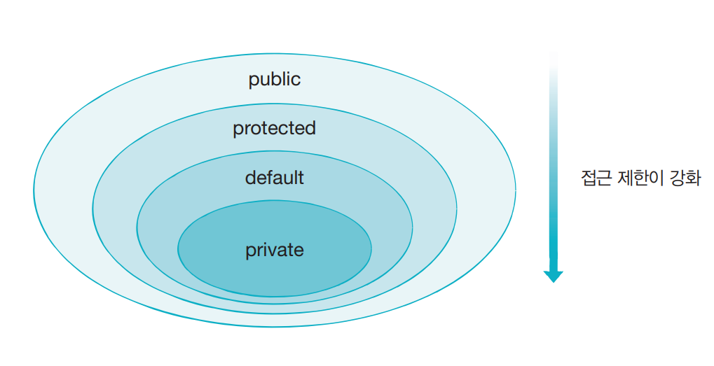
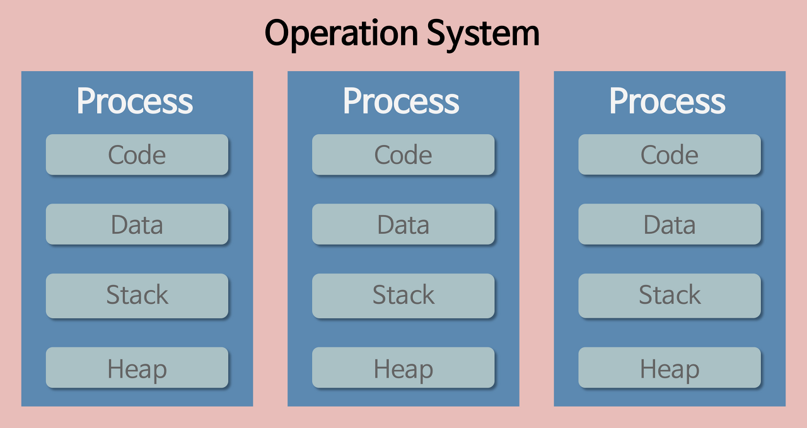

# 자바 핵심 개념 정리 2

JAVA의 접근 제어자의 종류와 특징에 대해 설명해주세요.

- public
  - 외부 클래스가 자유롭게 사용할 수 있도록 함
  - 
- protected
  - 같은 패키지의 모든 클래스에서 사용할 수 있도록 함
  - 다른 패키지에 있어도 자식 클래스일 경우 접근 허용
- private
  -  외부에서 사용될 수 없도록 함
  - 해당 멤버를 선언한 클래스에서만 사용 가능
- default
  - 위 세 가지 접근 제어자가 설정되지 않을 경우 가지게 됨(생략 가능)
  - 같은 패키지에 소속된 클래스에서만 사용할 수 있도록 함

 

OOP의 5대 원칙 (SOLID)에 대해 설명해주세요.

1. SRP(단일 책임 원칙)
- 해당 모듈이 여러 대상 또는 액터들에 대해 책임을 가져서는 안되고, 오직 하나의 액터에 대해서만 책임을 져야 한다.
- 모듈이 변경되는 이유가 한가지여야 함.
- 단일 책임 원칙을 제대로 지키면 변경이 필요할 때 수정할 대상이 명확해짐
2. OCP(개방-폐쇄 원칙)
- 확장에 대해 열려있고 수정에 대해서는 닫혀있어야 한다.
  - `확장에 대해 열려 있다` : 요구사항이 변경될 때 새로운 동작을 추가하여 애플리케이션의 기능을 확장할 수 있음을 의미
  - `수정에 대해 닫혀 있다` : 기존의 코드를 수정하지 않고 애플리케이션의 동작을 추가하거나 변경할 수 있어야 함을 의미
-  개방 폐쇄 원칙을 지키기 위해서는 추상화에 의존해야 함.
   ➕`추상화`란, 핵심적인 부분만 남기고, 불필요한 부분은 제거함으로써 복잡한 것을 간단히 하는 것.
3. LSP(리스코프 치환 원칙)
- 하위 타입은 상위 타입을 대체할 수 있어야 한다는 것.
- 즉, 해당 객체를 사용하는 클라이언트는 상위 타입이 하위 타입으로 변경되어도, 차이점을 인식하지 못한 채 상위 타입의 서브 클래스를 사용할 수 있어야 한다.
- 자식 클래스가 부모 클래스를 대체하기 위해서는 부모 클래스에 대한 클라이언트의 가정을 준수해야 함.
4. DIP(의존 역전 원칙)
- 고수준 모듈은 저수준 모듈의 구현에 의존해서는 안 되며, 저수준 모듈이 고수준 모듈에 의존해야 한다.
  - `고수준 모듈` : 입력과 출력으로부터 먼(비즈니스와 관련된) 추상화된 모듈
  - `저수준 모듈` : 입력과 출력으로부터 가까운(HTTP, 데이터베이스, 캐시 등과 관련된) 구현 모듈
- 즉, 비즈니스와 관련된 부분이 세부 사항에는 의존하지 않는 설계 원칙을 의미함.
- 의존 역전 원칙은 개방 폐쇄 원칙과 밀접한 관련이 있으며, 의존 역전 원칙이 위배되면 개방 폐쇄 원칙 역시 위배될 가능성이 높음.
5. ISP(인터페이스 분리 원칙)
- 클라이언트의 목적과 용도에 적합한 인터페이스만을 제공해야 한다.
- 모든 클라이언트가 자신의 관심에 맞는 퍼블릭 인터페이스(외부에서 접근 가능한 메세지)만을 접근하여 불필요한 간섭을 최소화할 수 있음.
- 기존 클라이언트에 영향을 주지 않은 채로 유연하게 객체의 기능을 확장하거나 수정할 수 있음.

 

non-static 멤버와 static 멤버의 차이에 대해 설명해주세요.

> Static 멤버 = 클래스 멤버
>   non-Static 멤버 = 인스턴스 멤버

- Static
  - 처음 JVM이 실행되어 클래스가 메모리에 올라갈 때부터 프로그램이 종료될 때까지 유지됨 ➡️ 클래스가 여러번 생성되어도 Static 멤버는 **딱 한 번만** 생성됨.
  - **동일한 클래스의 모든 객체들에 의해서 공유**됨
- non-Static
  - 객체 생성 시마다 **매번 새로운 변수가 생성**됨
  - 객체들에 의해서 **공유되지 않음**

 

클래스, 객체, 인스턴스의 차이에 대해 설명해주세요.

1. 클래스
- 객체를 정의하고 만들어 내기 위한 설계도 혹은 틀
- 내부에 객체를 만들어내기 위해 필요한 변수와 메서드들이 존재(연관되어 있는 변수와 메서드의 집합이라고 할 수 있음)
2. 객체
- **클래스에 선언된 모양 그대로 생성**된 실체
- 클래스의 인스턴스라고 부름
3. 인스턴스
- 클래스를 통해서 구현해야할 대상(객체)이 실제로 구현된 구체적인 실체. 즉, **객체를 소프트웨어에 실체화한 것**.
- 실체화된 인스턴스는 메모리에 할당됨
4. 클래스 vs. 객체: 클래스는 설계도, 객체는 설계도로 구현한 대상. 클래스가 객체를 만들어냄.(?)
5. 객체 vs. 인스턴스: 객체는 클래스의 타입으로 *선언*되고, 인스턴스는 메모리에 할당되어 *실제 사용*됨 

 

⭐️ 프로세스, 스레드, 멀티프로세스, 멀티스레드에 대해 설명해주세요.

1. 프로세스
- 운영체제로부터 자원을 할당 받은 작업의 단위. 즉, **프로그램이 실행된 상태**를 의미함.
- 최소 1개의 스레드를 가지고 있음.
- 각 프로세스의 독립된 메모리 영역을 Code, Data, Stack, Heap의 형식으로 할당해줌
  - Code: 코드 자체를 구성하는 메모리 영역
  - Data: 전역 변수, 정적 변수, 배열 등
  - Stack: 지역 변수, 매개 변수, 리턴 값
  - Heap: 동적 할당 시 사용 (new(), malloc() 등)
   
  
   
- 각 프로세스는 별도의 주소 공간에서 실행되고, 한 프로세스는 다른 프로세스의 변수나 자료구조에 접근할 수 없음. 
2. 스레드
- 프로세스 내에서 프로세스가 할당 받은 자원을 이용하는 실행 흐름의 단위
- 한 프로세스 내에 존재하는 여러 개의 스레드가 동시에 실행될 수 있음
- 프로세스가 할당 받은 메모리 영역 내에서, 쓰레드끼리 Code/Data/Heap 영역을 공유하고, Stack 영역은 별도로 관리함
3. 멀티프로세스
- 하나의 프로그램을 여러 개의 프로세스로 구성하여, 각 프로세스가 하나의 작업을 처리하는 것
- 장점: 하나의 프로세스에 문제가 생겨도, 전체적인 프로그램은 동작함
- 단점: 프로세스 끼리는 공유하는 메모리가 없기 때문에, `Context Switching`에 많은 비용이 발생합
  > ➕`Context Switching` : 어떤 CPU가 하나의 프로세스 또는 스레드를 실행하고 있는 상태에서 다른 Task 를 실행해야할 때, 현재 실행하고 있는 Task의 상태 또는 레지스터 값을 저장하고, 다음에 실행해야하는 Task의 상태 또는 레지스터 값을 불러오는 작업
4. 멀티스레드
- 하나의 프로그램을 여러 개의 스레드로 구성하고, 각 쓰레드가 하나의 작업을 처리하는 것
- 이때, 프로세스는 한 개일수도, 여러 개일수도 있음
- 장점: 자원의 효율성 증대, Context Switching 처리 비용 감소, 응답 속도 향상
- 단점: 쓰레드 하나에 문제가 생기면, 모든 프로세스가 종료됨, 자원을 공유하기 때문에 동기화 문제가 발생할 수밖에 없음

 
